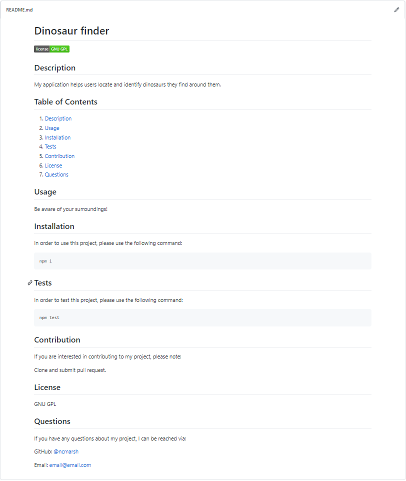

# README generator

Projects take time. Save some of that time by using this easy-to-use, professional README generator!

## Table of Contents

1. [Usage](#Usage)
1. [Languages and Concepts](#Languages-and-Concepts)
1. [Installation](#Installation)
1. [Demo](#Demo)
1. [Method](#Method)
1. [Roadmap](#Roadmap)
1. [Links](#Links)
1. [Contact](#Contact)
1. [Contributing](#Contributing)
1. [License](#License)

## Usage

This command line application is designed to save you time writing your README, freeing up extra time you can focus on your project. With this README generator, you'll be able to describe what your project is, how a user uses, installs and tests it, if and how you would like the user to contribute to the project, the license you have chosen and how users can contact you with any questions by adding your GitHub username and email. 

## Languages and Concepts

- JavaScript
- Node.js
- Node package manager
- Node modules
- NPM - Inquirer.js

## Installation

Follow these steps to get started:

After cloning the repository to your local computer, you'll want to install its dependencies (inquirer). You can do this by running:

    $ npm i

Then to start the program, you'll run:

    $ node index.js

Once you're finished, you'll find your generated README in the following folder:

    ./created/README.md

## Demo

<!--  -->
<!--  -->
<!--  -->
<!--  -->

<!-- <video width="320" height="240" controls>
    <source src="./assets/README_demo4.mp4" type="video/mp4">
    </source>
</video> -->

## Method

To begin this project, I first created my files, including a .gitignore, and ran:

    $ npm init
    $ npm i inquirer

These prompts establish the npm inquirer package. 

Next I created the questions array, to include the questions I want my program to prompt the user. I've included questions that take input, some with a default answer that the user can choose, and one with a list of options.

The next step was to then create the function writeToFile. Using template strings, I was able to write the full Markdown file, adding in the responses from the user. Here I tested the prompts and the writeToFile function and it is working.

To make the code cleaner, I moved the Markdown into a separate file/function generateMarkdown. This will keep the Markdown template in a separate file, making it easier and cleaner to read, access and edit at a later date. It will also make it so it can be reused in other projects.

Once I exported the module for the generateMarkdown and ran the code, I began receiving errors, that the parameters I was giving the function were undefined. I was able to determine that the order I had the parameters in were incorrect. Once I got the parameters in the correct order, my program was working once again.

Now that the code was working, I noticed that the generated Markdown page had a formatting issue, in that it was all blocked out to look like code and it wasn't reading the Markdown language. I figured out it was because I had my Markdown file written out with each line being indented, adding additional characters to the file. After making this adjustment, the file was reading correctly.

With the README generator working, I added a badge to the top of the file to show what license the user had chosen. I had trouble getting it to work in the beginning, finding that if the license had a space, the URL wouldn't work. After some research I found that if I add angle brackets <> around the URL, it will work, and it did!

Then to finish my application, I got the user's GitHub username to link to their GitHub profile on the generated README and organized the layout, between the questions and how the information lays out on the new README file.

## Roadmap

To further this project, I would like to customize the contact question. I would like to first ask the user to select what types of communication they would like to include (GitHub, email, twitter, etc) and then they enter their information for the specific ones they chose.

## Links

- [Project Repository](https://github.com/ncmarsh/README_generator)
- [View the walkthrough](#Demo)

## Contact

- Nicole Marshall - [@ncmarsh](https://github.com/ncmarsh)

## Contributing

This is a personal project; no contributions are required at this time.

## License

No license granted.

##### [Return to Top of Page](#README-generator)